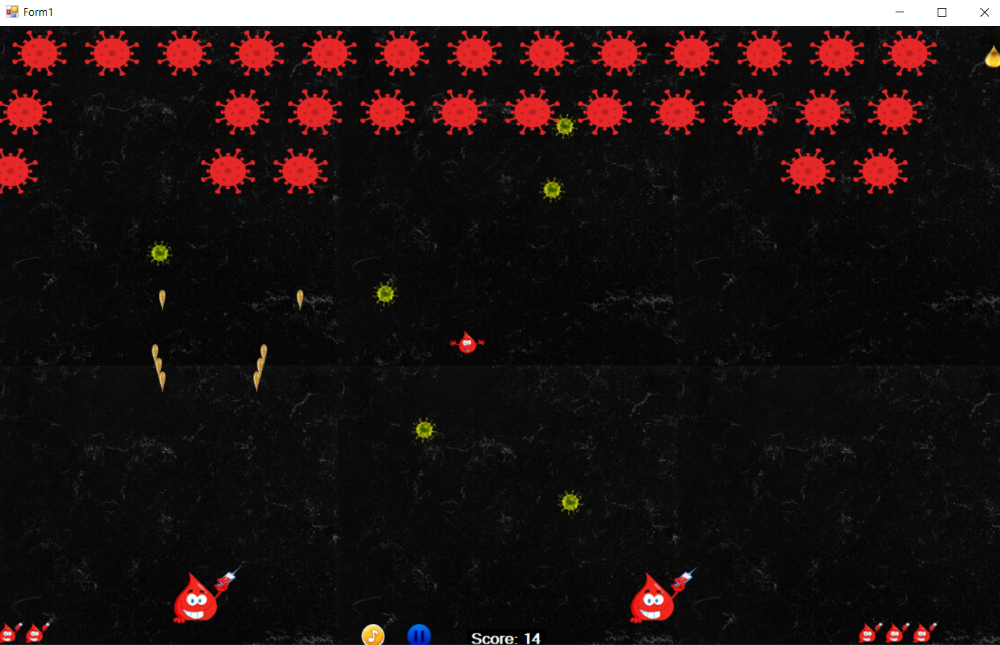
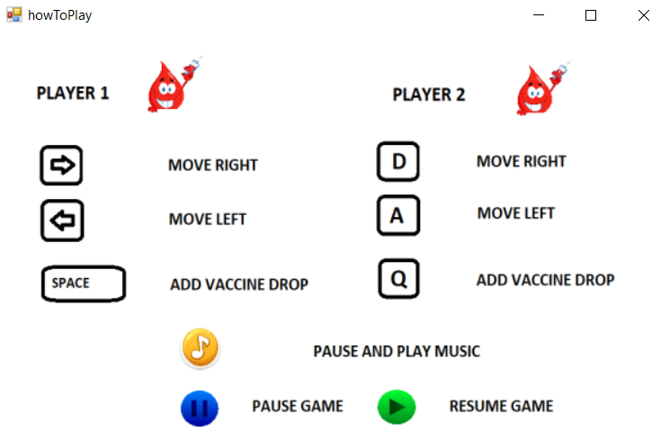

# COVID19_Invaders

### Опис на играта
Изворната мотивација за играта COVID19 Invaders претставува играта Chicken Invaders. Играта нуди можнoст за играње со еден играч или со двајца играчи. Играчите претставуваат вакцини, а противници се ковид напаѓачите. Играчите ги убиваат ковид напаѓачите со своето оружје – капки вакцина. Ова оружје можи да се појача со земање на капка за моќ. Дополнително напаѓачите имаат свое оружје со кое се бранат – ковид оружје. Секој играч на почеток има 3 животи. Бројот на животи може да се зголеми со собирање на капка вакцина, при што максималниот број на животи изнесува 5. Играта има 5 нивоа и на секое ниво тежината се зголемува. При секој погодок на играчот од ковид оружје се намалува бројот на животи. Доколку ковид напаѓач го допре играчот, играчот е инфектиран со ковид. Играта завршува кога сите играчи се убиени или кога е победен вирусот. Целта на играта е да се уништи ковид вирусот и да се постигнат поголем број на поени. 

### Опис на решението
Форми:
- start – нуди можност за преглед на упатство за играње и избор напочнување на играта со еден или двајца играчи
- howToPlay – прикажува упатство за играње на играта
- Form1 – форма за играње на играта
- nextLevel – се прикажува при зголемување на ниво и има копче за продолжување и прекинување на играта
- gameOver – се прикажува на крај на играта, има копче за започнување нова игра и за затворање

Класи:
- Scene претставува класа која го води текот на играта низ различните нивоа.
- level e апстрактна класа за еден левел од играта, таа има три апстрактни методи: public abstract void makeInvaders();  public abstract void gameTimerTick();  public abstract void moveEnemy(); Овие методи се преоптоваруваат во изведените класи LittleInvadersLevel и BigInvadersLevel.  
- Player – класа за играч
- Bullet – класа за оружје на играч
- Invader - класа за напаѓач
- InvaderBullet – класа за оружје на напаѓач


#### Главните податоци и методи се чуваат во класата level
Промеливи во класата level:

```csharp
        public List<Invader> sadInvaders { get; set; } //листа со ковид напаѓачи
        public List<InvaderBullet> sadInvadersBullets { get; set; } //листа со ковид оружје
        public List<PictureBox> livesList { get; set; } //листа со бонус животи
        public List<Bullet> bullets { get; set; } //листа со капки вакцина
        public List<PictureBox> powerList { get; set; } //листа со бонус моќ
        public Form1 form { get; set; } //форма за приказ
        public static Random random = new Random(); //променлива за генерирање рандом број
        public int numPlayers { get; set; } //број на играчи
        public Player player1 { get; set; } //прв играч
        public Player player2 { get; set; } //втор играч

```
Методот moveEnemy() од апстрактната класа level е преоптоварен во наследената класа LittleInvadersLevel. Секој напаѓач се поместува и се проверува дали ја преминал висината на прозорецот при што би се избришал од листата. Во спротивно се проверува дали напаѓачот допира играч, доколку е допрен играч истиот умира. Дополнително за секоја капка вакцина се проверува дали корона напаѓачот е погоден, доколку е напаѓачот и капката вакцина се бришат, а се зголемува бројот на поени.

```csharp

public override void moveEnemy()
        {
            for (int i = sadInvaders.Count - 1; i >= 0; i--)
            {
                    sadInvaders[i].moveInvader(form.Width);
                    if (sadInvaders[i].pictureBox.Top > form.Height)
                    {
                        sadInvaders.Remove(sadInvaders[i]);
                        break;
                    }
                    else
                    {
                        if (player1 != null)
                        {
                            if (sadInvaders[i].pictureBox.Bounds.IntersectsWith(player1.pictureBox.Bounds))
                            {
                                player1 = null;
                            }
                        }
                        if (player2 != null)
                        {
                            if (sadInvaders[i].pictureBox.Bounds.IntersectsWith(player2.pictureBox.Bounds))
                            {
                                player2 = null;
                            }
                        }
                    }
                for (int j = bullets.Count - 1; j >= 0; j--)
                {
                    if (bullets[j].pictureBox.Bounds.IntersectsWith(sadInvaders[i].pictureBox.Bounds))
                    {
                        bullets.Remove(bullets[j]);
                        sadInvaders.Remove(sadInvaders[i]);
                        Scene.score += 1;
                        break;
                    }
                }
            }

```
Методот moveEnemy() на наследената класа BigInvadersLevel е поразличен од претходниот. Со тоа што за секоја капка вакцина се проверува дали корона напаѓачот е погоден, доколку е погоден се намалува неговата сила и се зголемува бројот на поени. Кога негоавата сила ќе достигне 0, напаѓачот се бриши. Потоа секој напаѓач се поместува.

```csharp

public override void moveEnemy()
        {
            for (int i = sadInvaders.Count - 1; i >= 0; i--)
            {
                for (int j = bullets.Count - 1; j >= 0; j--)
                {
                    if (bullets[j].pictureBox.Bounds.IntersectsWith(sadInvaders[i].pictureBox.Bounds))
                    {
                        bullets.Remove(bullets[j]);
                        --sadInvaders[i].strength;
                            if (sadInvaders[i].strength == 0)
                                sadInvaders.Remove(sadInvaders[i]);
                        
                        Scene.score += 1;
                        break;
                    }
                }
            }
            if ( sadInvaders.Count > 0)
            {
                if (sadInvaders.Count > 1)
                {
                    sadInvaders[0].moveInvaderBig();
                    sadInvaders[1].moveInvaderBig();
                }
                else
                {
                    sadInvaders[0].moveInvaderBig();
                }
            }
        }

```
### Изглед на играта


### Кратко упатство
Кратко упатство за играње се прикажува на формата howToPlay.  При тоа првиот играч се движи во десно со притискање на Right Key, во лево со притискање на Left Key, а пука од своето оружје со притискање на Space. Вториот играч се движи во десно со притискање на D Key, во лево со притискање на A Key, а пука од своето оружје со притискање на Q. Дополнително играчите имаат можност да ја паузираат и продолжат музиката со кликање на контролата на прозорецот и да ја паузираат и продолжат играта со кликање на соодветнта контрола.


